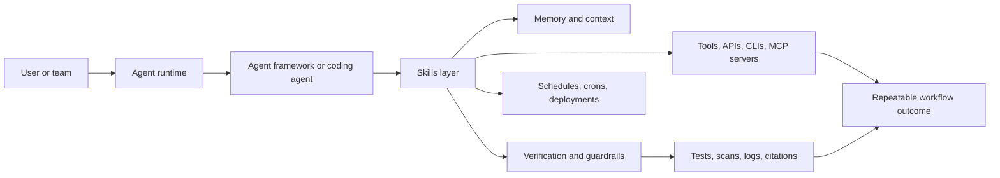

# Agent Skills Resources

A companion resource hub for understanding agent skills, skill-based workflows,
and the frameworks, labs, and tools shaping the agent ecosystem.

This repo is a guide. The canonical catalog is
[agentskillexchange/skills](https://github.com/agentskillexchange/skills), and
the live marketplace is [Agent Skill Exchange](https://agentskillexchange.com/).

[](data/resources.json)
[](https://github.com/agentskillexchange/skills)

## What This Is

Agent skills are reusable instructions, workflows, and tool-usage patterns that
help agents perform repeatable work. A good skill explains when to use a tool,
how to set it up, what safety checks matter, and how to verify the result.

This repo helps developers answer four questions:

- Where do skills fit in the agent stack?
- Which labs, frameworks, and runtimes support skill-like workflows?
- How should teams evaluate, write, and verify skills?
- Where can I find source-backed examples without confusing them for the main
  ASE catalog?

## Ecosystem Map



## Quick Paths

| Path | Start here | What to read next |
|---|---|---|
| New to skills | [Getting Started](getting-started.md) | [Ecosystem Map](ecosystem-map.md) |
| Building a skill | [Best Practices](best-practices.md) | [ASE skills repo](https://github.com/agentskillexchange/skills) |
| Comparing frameworks | [Framework pages](frameworks/) | [resources.json](data/resources.json) |
| Evaluating trust | [Best Practices](best-practices.md#trust-and-safety-checklist) | [ASE verification](https://github.com/agentskillexchange/skills/tree/main/verification) |
| Contributing | [CONTRIBUTING](CONTRIBUTING.md) | [ASE Create Skill](https://agentskillexchange.com/create-skill/) |

## Framework And Resource Guide

| Area | Role in the ecosystem | Guide |
|---|---|---|
| Codex | Coding agent and terminal workflow runtime | [Codex](frameworks/codex.md) |
| Claude Code | Coding agent with project workflows, tools, and automation | [Claude Code](frameworks/claude-code.md) |
| OpenClaw | Agent runtime for providers, crons, skills, tools, and channels | [OpenClaw](frameworks/openclaw.md) |
| Hermes | Self-improving agent with skills, memory, and agent-managed workflows | [Hermes](frameworks/hermes.md) |
| Cursor | IDE agent environment with context, skills, and background agents | [Cursor](frameworks/cursor.md) |
| Gemini CLI | Open-source terminal agent from Google | [Gemini](frameworks/gemini.md) |
| LangChain / LangGraph | Agent orchestration and stateful workflow framework | [LangChain / LangGraph](frameworks/langchain-langgraph.md) |
| MCP | Protocol for connecting agents to tools and context providers | [MCP](frameworks/mcp.md) |

## Source Labels

Every resource in [data/resources.json](data/resources.json) uses one of four
labels:

- `Official`: vendor or project-owned documentation or repository.
- `Lab`: research lab, model provider, or frontier-lab material.
- `Community`: useful third-party material that is not official.
- `ASE`: Agent Skill Exchange site, repo, data, or documentation.

When a claim is not source-backed, leave it out.

## Data Files

- [data/resources.json](data/resources.json): structured source list.
- [data/ase-skill-mapping.json](data/ase-skill-mapping.json): representative
  ASE skill examples by framework and workflow area.

## Validation

```bash
python3 scripts/validate-resources.py
python3 scripts/validate-links.py
```

## Loop Roadmap

Loop 1 creates the resource hub and validation shape. Future loops should expand
one area at a time:

1. Deepen Codex, Claude Code, OpenClaw, Hermes, Cursor, Gemini, LangGraph, and MCP pages.
2. Add more ASE skill mappings from the public catalog.
3. Add visual workflow stacks for security, data, SRE, legal, GTM, and support.
4. Add a freshness audit that flags moved docs, stale links, or unsupported claims.

