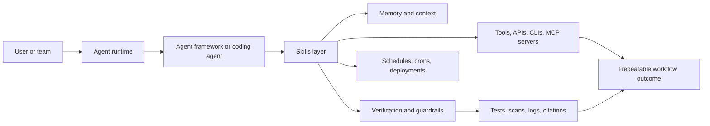

# Agent Skills Resources

A source-backed companion resource hub for agent skills, AI agents, coding
agents, and skill-based agent workflows.

Use this repo to learn the ecosystem, compare frameworks, evaluate skills, and
run pilots. Use [agentskillexchange/skills](https://github.com/agentskillexchange/skills)
as the canonical catalog, and use [Agent Skill Exchange](https://agentskillexchange.com/)
to browse the live marketplace.

[](data/resources.json)
[](https://github.com/agentskillexchange/skills)

Start with the [Overview](overview.md) or the generated [Repo Stats](generated/repo-stats.md).

## About This Repo

This is a source-backed companion guide for agent skills and AI agent workflows.
It provides framework resources, visual maps, examples, rollout playbooks,
evaluation templates, and source-labeling guidance. The installable skill source
of truth remains [agentskillexchange/skills](https://github.com/agentskillexchange/skills).

## What You'll Find Here

| Need | Start here |
|---|---|
| Learn the agent skills ecosystem | [Overview](overview.md) |
| Compare Codex, Claude Code, GitHub Copilot, OpenClaw, Hermes, Cursor, Gemini CLI, LangChain, LangGraph, MCP, and OpenAI Agents SDK | [Framework pages](frameworks/) |
| Review source-backed resources | [Resource Index](generated/resource-index.md) |
| Evaluate skill quality and agent safety | [Quality Checklist](examples/quality-checklist.md) |
| Run a bounded rollout | [Playbooks](playbooks/) and [Templates](templates/) |

## Use This Repo When

- You want to understand where agent skills fit across AI agents, coding agents,
  MCP, Model Context Protocol, Codex, Claude Code, GitHub Copilot, OpenClaw,
  Hermes Agent, Cursor, Gemini CLI, LangChain, LangGraph, and OpenAI Agents SDK.
- You need source-backed framework resources, visual maps, examples, skill
  evaluation templates, agent safety checks, verification guidance, or rollout
  playbooks.
- You want representative examples without copying the full catalog.

## Do Not Use This Repo For

- The full skill catalog.
- The installable skill source of truth.
- Official vendor claims unless the claim is source-backed.
- Catalog-wide generated skill dumps.

## What This Is

Agent skills are reusable instructions, workflows, and tool-usage patterns that
help agents perform repeatable work. A good skill explains when to use a tool,
how to set it up, what safety checks matter, and how to verify the result.

This repo helps developers answer four questions:

- Where do skills fit in the agent stack?
- Which labs, frameworks, and runtimes support skill-like workflows?
- How should teams evaluate, write, and verify skills?
- Where can I find source-backed examples without confusing them for the main
  ASE catalog?

It covers MCP and the Model Context Protocol, verification, skill evaluation,
rollout playbooks, and practical adoption evidence for teams working with
agentic development and operations.

## How This Differs From `agentskillexchange/skills`

| Repo | Purpose | Use it for |
|---|---|---|
| [agent-skills-resources](https://github.com/agentskillexchange/agent-skills-resources) | Companion guide | Learning, diagrams, framework links, best practices, and curated examples |
| [agentskillexchange/skills](https://github.com/agentskillexchange/skills) | Canonical catalog | Actual skill files, generated indexes, categories, verification, and installable entries |
| [agentskillexchange.com](https://agentskillexchange.com/) | Live marketplace | Browsing, search, skill pages, industry collections, and creation workflows |

## Skill Ecosystem Layers

| Layer | Examples | What skills add |
|---|---|---|
| Model/provider | OpenAI, Anthropic, Google | Model-specific setup and constraints |
| Runtime | Codex, Claude Code, OpenClaw, Hermes, Cursor, Gemini CLI | Repeatable agent workflows |
| Framework | LangGraph, OpenAI Agents SDK, ADK | Orchestration patterns and state |
| Protocol/tooling | MCP, CLIs, APIs, browser tools | Tool setup, permissions, and usage recipes |
| Verification | tests, scans, traces, approvals | Evidence that the workflow worked |

## Ecosystem Map



## Quick Paths

| Path | Start here | What to read next |
|---|---|---|
| New to skills | [Getting Started](getting-started.md) | [Ecosystem Map](ecosystem-map.md) |
| Building a skill | [Best Practices](best-practices.md) | [ASE skills repo](https://github.com/agentskillexchange/skills) |
| Comparing frameworks | [Framework pages](frameworks/) | [resources.json](data/resources.json) |
| Exploring workflows | [Workflow pages](workflows/) | [ASE skill mapping](data/ase-skill-mapping.json) |
| Applying skills to scenarios | [Case Studies](case-studies/) | [Generated skill mapping index](generated/ase-skill-mapping-index.md) |
| Planning adoption | [Playbooks](playbooks/) | [Adoption Matrix](adoption-matrix.md) |
| Running a pilot | [Evaluation Templates](templates/) | [Template Index](generated/template-index.md) |
| Reviewing quality | [Annotated Examples](examples/annotated-skill-examples.md) | [Quality Checklist](examples/quality-checklist.md) |
| Maintaining resources | [Freshness Audit](maintenance/freshness-audit.md) | [Source Labeling](maintenance/source-labeling.md) |
| Evaluating trust | [Best Practices](best-practices.md#trust-and-safety-checklist) | [ASE verification](https://github.com/agentskillexchange/skills/tree/main/verification) |
| Contributing | [CONTRIBUTING](CONTRIBUTING.md) | [ASE Create Skill](https://agentskillexchange.com/create-skill/) |

## Framework And Resource Guide

| Area | Role in the ecosystem | Guide |
|---|---|---|
| Codex | Coding agent and terminal workflow runtime | [Codex](frameworks/codex.md) |
| Claude Code | Coding agent with project workflows, tools, and automation | [Claude Code](frameworks/claude-code.md) |
| GitHub Copilot | GitHub-native coding assistant, cloud agent, CLI, SDK, MCP, and skills surface | [GitHub Copilot](frameworks/github-copilot.md) |
| OpenClaw | Agent runtime for providers, crons, skills, tools, and channels | [OpenClaw](frameworks/openclaw.md) |
| Hermes | Self-improving agent with skills, memory, and agent-managed workflows | [Hermes](frameworks/hermes.md) |
| Cursor | IDE agent environment with context, skills, and background agents | [Cursor](frameworks/cursor.md) |
| Gemini CLI | Open-source terminal agent from Google | [Gemini](frameworks/gemini.md) |
| LangChain / LangGraph | Agent orchestration and stateful workflow framework | [LangChain / LangGraph](frameworks/langchain-langgraph.md) |
| MCP | Protocol for connecting agents to tools and context providers | [MCP](frameworks/mcp.md) |

## Source Labels

Every resource in [data/resources.json](data/resources.json) uses one of four
labels:

- `Official`: vendor or project-owned documentation or repository.
- `Lab`: research lab, model provider, or frontier-lab material.
- `Community`: useful third-party material that is not official.
- `ASE`: Agent Skill Exchange site, repo, data, or documentation.

When a claim is not source-backed, leave it out.

## Data Files

- [data/resources.json](data/resources.json): structured source list.
- [data/ase-skill-mapping.json](data/ase-skill-mapping.json): representative
  ASE skill examples by framework and workflow area.
- [generated/resource-index.md](generated/resource-index.md): generated resource
  index grouped by source type, framework, and tag.
- [generated/ase-skill-mapping-index.md](generated/ase-skill-mapping-index.md):
  generated representative ASE skill index grouped by workflow and framework.
- [generated/nav-index.md](generated/nav-index.md): generated navigation index
  for framework, workflow, example, case-study, playbook, and maintenance pages.
- [generated/template-index.md](generated/template-index.md): generated index of
  fillable pilot and review templates.
- [generated/repo-stats.md](generated/repo-stats.md): generated repository data
  snapshot.
- [workflows/](workflows/): visual workflow guides that show how skills fit into
  practical SRE, security, data, content, and research work.
- [case-studies/](case-studies/): practical scenarios that connect 2-4 existing
  ASE skills into reviewable workflows.
- [playbooks/](playbooks/): adoption guides for teams evaluating skill-based
  workflows.
- [templates/](templates/): fillable worksheets for evaluation, risk review,
  security review, rollout readiness, and post-pilot review.
- [adoption-matrix.md](adoption-matrix.md): lightweight comparison of starting
  workflows, risk levels, rollout paths, and expected evidence.

## Quality Loop

Use the repo as a small maintenance loop:

1. Add or revise source-backed resources.
2. Map only existing ASE skill slugs.
3. Review examples against the [quality checklist](examples/quality-checklist.md).
4. Run validation and freshness checks.
5. Keep source labels honest when ownership changes.

## Validation

```bash
python3 scripts/validate-resources.py
python3 scripts/validate-links.py
python3 scripts/audit-freshness.py
python3 scripts/generate-resource-index.py
python3 scripts/generate-skill-mapping-index.py
python3 scripts/generate-nav-index.py
python3 scripts/generate-template-index.py
python3 scripts/generate-repo-stats.py
```

## Loop Roadmap

Future loops should expand one area at a time:

1. Deepen Codex, Claude Code, GitHub Copilot, OpenClaw, Hermes, Cursor, Gemini, LangGraph, and MCP pages.
2. Add more ASE skill mappings from the public catalog.
3. Add visual workflow stacks for security, data, SRE, legal, GTM, and support.
4. Add a freshness audit that flags moved docs, stale links, or unsupported claims.
5. Add deeper case studies for teams evaluating adoption paths.
6. Add adoption playbooks for team-specific rollout decisions.
7. Add fillable pilot templates for recording evidence and go/no-go decisions.
8. Add completed evaluation examples and repo stats for stronger first-read clarity.
