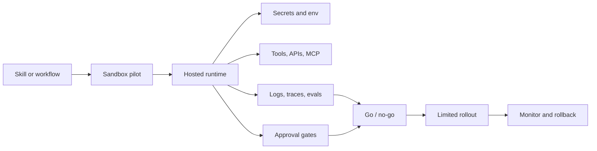

# Deployment Overview

Agent skills become more useful when they can run repeatably in the same
environment with the same credentials, limits, and evidence capture. Deployment
is the step where a reusable instruction pattern becomes an operated workflow.

## Deployment Loop

## What To Decide Before Hosting

| Decision | Why it matters |
|---|---|
| Runtime boundary | Determines whether code runs in a web app, job, worker, container, or sandbox. |
| Credential scope | Limits what the workflow can read or change. |
| Approval gate | Prevents unexpected writes, messages, deployments, or sensitive actions. |
| Observability | Makes failures reviewable instead of anecdotal. |
| Rollback | Gives the team a safe way to stop or revert the workflow. |

## Where Deployment Fits

- Use [framework pages](../frameworks/) to understand authoring surfaces.
- Use [ecosystem pages](../ecosystems/) to understand runtime and vendor options.
- Use [Agent Ops](../ops/) for traces, evals, approvals, and model gateways.
- Use [Security](../security/) for guardrails, secrets, and policy review.

## Good Deployment Evidence

- input and output samples from the pilot
- trace or log links for representative runs
- approval records for sensitive actions
- eval or regression results
- environment and secret ownership
- rollback path and on-call owner
