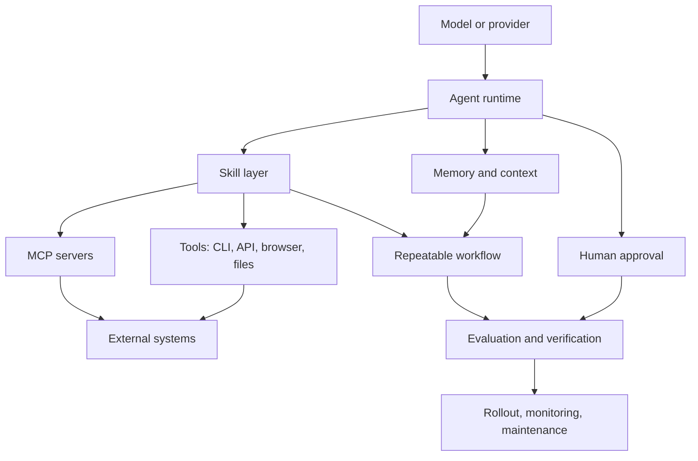

# Agent Skill Ecosystem

This framework-neutral map shows where skills sit relative to models, runtimes,
tools, MCP, memory, evaluation, and operations.

Skills are the policy and workflow layer. Tools and MCP provide capability;
skills explain when and how those capabilities should be used.
