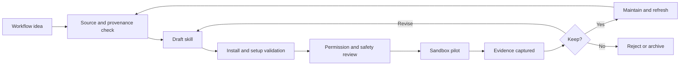

# Skill Lifecycle

This diagram shows the lifecycle of a skill from idea to maintenance.

The lifecycle is intentionally review-heavy. A skill is not just an instruction
file; it is a workflow that should stay accurate as tools and policies change.
