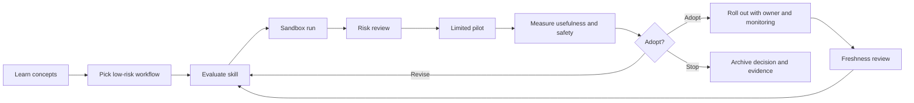

# Team Adoption Loop

Teams should move from learning to production through a small evidence loop.

The loop keeps adoption reversible. Each step should leave enough evidence for a
future reviewer to understand why the team continued or stopped.
