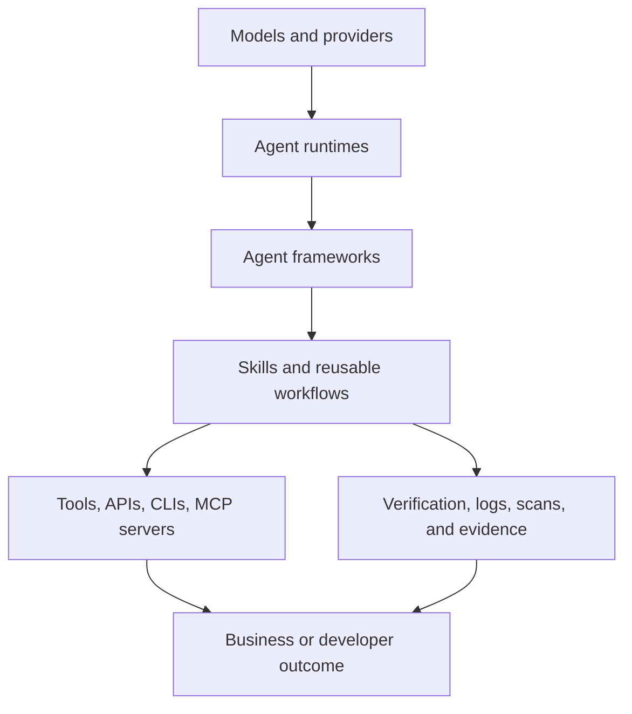
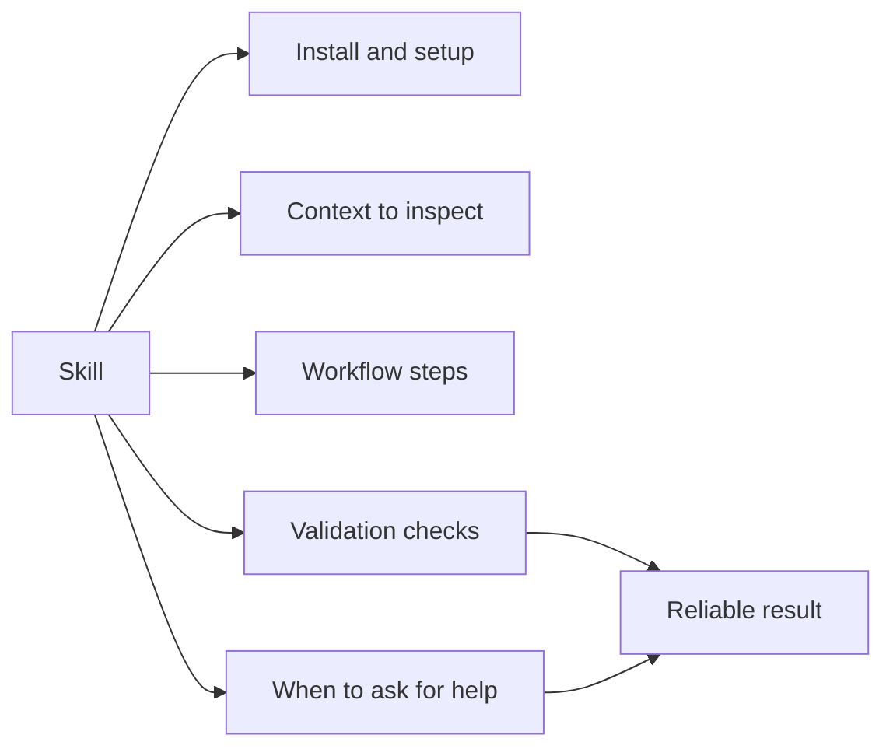
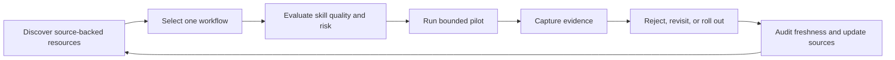

# Agent Skills Ecosystem Map

Skills sit between a general-purpose agent and the concrete tools, commands, and
workflows the agent needs to operate reliably.

## Stack View

## Skills Vs Adjacent Concepts

| Concept | What it is | How skills relate |
|---|---|---|
| Agent | The system that plans and acts. | Skills teach the agent repeatable procedures. |
| Tool | A callable function, API, CLI, or MCP server. | Skills explain when and how to use tools safely. |
| MCP | A protocol for connecting tools and context to agents. | Skills can wrap MCP workflows and usage patterns. |
| Workflow | A sequence of steps with checks and outcomes. | Skills turn workflows into reusable instructions. |
| Memory | Stored context, preferences, and history. | Skills can define what to remember and when to retrieve it. |
| Guardrail | A rule, approval, test, or safety check. | Strong skills include verification and escalation points. |

## Practical Roles

## Agent Skill Adoption Loop

## What Makes A Skill Useful

A useful skill is specific enough to execute and broad enough to reuse. It should
name the upstream source, explain installation, show real usage, and state how
to verify the result.

Weak skills usually fail in predictable ways:

- They only say "copy this folder" instead of explaining the upstream tool.
- They claim popularity or official status without a source.
- They skip prerequisites, credentials, or security checks.
- They describe a category instead of a concrete workflow.
