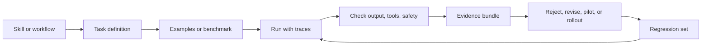

# Evaluation Overview

Evaluation turns agent skill claims into reviewable evidence. A useful eval does
not only ask whether the model answered correctly. It checks whether the whole
workflow used the right tools, respected permissions, produced usable output,
and left enough evidence for a human to trust the result.

## Evaluation Loop

## Evaluation Layers

| Layer | What it checks | Example evidence |
|---|---|---|
| Task fit | whether the skill matches a repeatable workflow | task definition, examples |
| Output quality | whether the answer or artifact is useful | expected output, rubric |
| Tool behavior | whether tools were called correctly | trace, command log, API log |
| Safety | whether risky actions were blocked or approved | approval record, policy result |
| Regression | whether future changes preserve behavior | saved test set, run history |

## Public Benchmark vs Workflow Eval

| Type | Use it for | Do not use it for |
|---|---|---|
| Public benchmark | orientation, comparing broad capabilities | approving a production workflow by itself |
| Workflow eval | deciding whether a skill works for your task | claiming general model superiority |
| Regression eval | catching changes after updates | proving the skill is safe in all contexts |

## Good Evidence Bundle

- task description
- input examples
- expected output or rubric
- model/tool/run settings
- trace or command log
- safety and approval result
- pass/fail decision
- reviewer note
