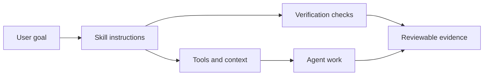

# Agent Skills 101

An agent skill is a reusable package of instructions, setup notes, constraints,
and verification steps for a repeatable agent workflow. It teaches an agent how
to perform a specific kind of work instead of making every user restate the same
process from scratch.

Skills are useful when the work has a stable shape:

- A coding agent should run the same review checks before opening a pull request.
- A research agent should cite sources and separate evidence from inference.
- A support agent should classify tickets before drafting replies.
- A data agent should inspect schema, sample rows, and query costs before writing a report.

## What A Skill Usually Contains

| Part | Purpose |
|---|---|
| Name and description | Make the workflow easy to discover |
| When to use it | Prevent accidental use outside the right context |
| Inputs and assumptions | Clarify what the agent needs before acting |
| Steps | Encode the repeatable workflow |
| Tools and permissions | Show what systems the agent may touch |
| Verification | Define evidence that the result worked |
| Safety notes | Capture approval, secrets, data, or execution risks |

## When Skills Help

Skills help most when the workflow is repeated, reviewable, and bounded. They
are less useful for one-off creative exploration, unclear goals, or tasks where
the agent should ask clarifying questions before following a fixed process.

## A Simple Mental Model

## First Exercise

Pick one workflow your team repeats weekly. Write down:

- What triggers the workflow?
- What tools are involved?
- What should never happen without approval?
- What evidence proves the workflow succeeded?

If those answers are clear, the workflow may be a good skill candidate.
