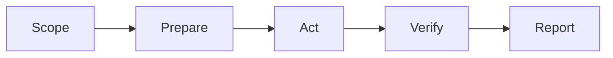

# Skill Design Patterns

Good skills usually follow a small number of repeatable patterns. Pick the
pattern that matches the work instead of starting from a blank page.

## Pattern 1: Checklist Skill

Use when the workflow is mostly review or validation.

| Section | Include |
|---|---|
| Trigger | When the checklist should run |
| Checks | Ordered review points |
| Evidence | Logs, files, screenshots, tests, citations |
| Stop rules | Conditions that require human approval |

Example workflows: security review, release readiness, data quality review.

## Pattern 2: Tool Setup Skill

Use when a tool is powerful but easy to misuse.

| Section | Include |
|---|---|
| Prerequisites | Accounts, permissions, local dependencies |
| Minimal install | One clear path before alternatives |
| First safe command | A read-only or sandboxed command |
| Validation | How to prove the tool is installed and scoped |

Example workflows: CLI setup, MCP server connection, browser automation.

## Pattern 3: Guided Workflow Skill

Use when the agent should move through stages.

Each stage should say what the agent reads, what it may write, and when to stop.

## Pattern 4: Decision Skill

Use when the agent must choose between options.

| Decision | Evidence to collect |
|---|---|
| Use managed service or self-host | Data sensitivity, ops capacity, cost |
| Use browser automation or API | Stability, auth model, rate limits |
| Publish or hold | Verification result, safety flags, approval status |

## Pattern 5: Handoff Skill

Use when one agent or person hands work to another.

Include the current state, evidence gathered, decisions made, unresolved risks,
and next safe action. Avoid hidden assumptions.

## A Good Skill Is Boring In The Right Places

The steps should be predictable, the permissions should be explicit, and the
verification should be easy to inspect.
