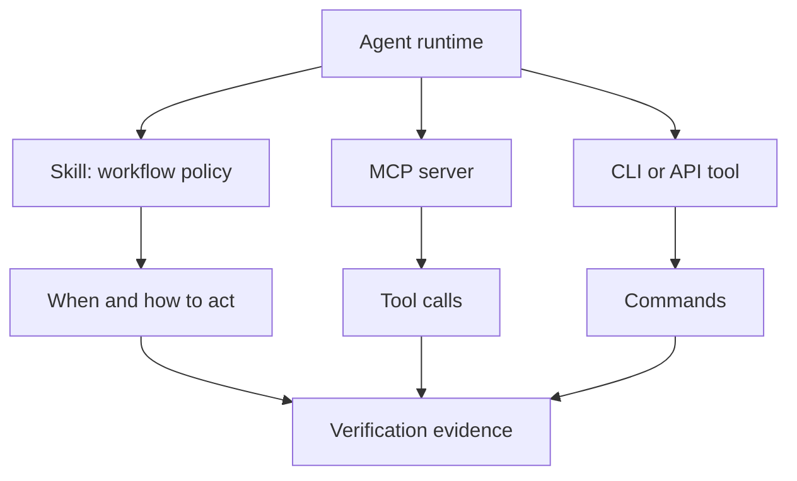

# Skills vs Tools vs MCP

Skills, tools, and MCP solve different problems. Confusing them leads to skills
that are too vague or tool integrations that lack safety guidance.

| Concept | What it is | What it is not |
|---|---|---|
| Skill | A reusable workflow instruction package | A direct API integration by itself |
| Tool | A callable capability such as a CLI, API, browser, or database query | A complete workflow policy |
| MCP server | A standardized way to expose tools and context to agents | A guarantee that tool use is safe |
| Agent runtime | The environment that runs the model, tools, memory, and approvals | The skill content itself |
| Workflow | The ordered work the agent performs toward an outcome | A single command with no review path |

## How They Fit Together

## Practical Rule

Use a tool to do work. Use MCP to expose tools and context consistently. Use a
skill to describe when, why, and how the agent should use those tools safely.

## Common Mistakes

| Weak approach | Better approach |
|---|---|
| "Use this API." | "Use this API only after checking auth scope and rate limits." |
| "Call the database MCP." | "Inspect schema, run a bounded sample query, then produce reviewed SQL." |
| "Run the deployment command." | "Run build/test first, require approval for production, capture logs." |

## Where To Go Next

- For workflow structure, read [Skill Design Patterns](skill-design-patterns.md).
- For trust checks, read [Skill Evaluation Basics](skill-evaluation-basics.md).
- For rollout planning, read [Team Adoption Basics](team-adoption-basics.md).
