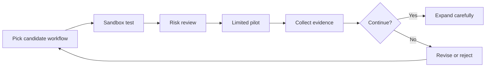

# Team Adoption Basics

Teams should adopt agent skills in small, reviewable steps. The safest path is a
pilot loop, not a broad rollout.

## Adoption Loop

## Start With Low-Blast-Radius Work

Good first pilots:

- Code review summaries that do not merge changes.
- Documentation updates in a branch.
- Read-only incident context gathering.
- Local data profiling on non-sensitive samples.
- Draft-only support or research workflows.

Avoid starting with:

- Production deploys.
- Unreviewed customer communication.
- Secret rotation.
- Destructive database or filesystem actions.
- Autonomous billing, legal, medical, or hiring decisions.

## Team Roles

| Role | Responsibility |
|---|---|
| Workflow owner | Defines the task and success criteria |
| Security reviewer | Checks permissions and data handling |
| Pilot users | Try the skill in realistic but bounded work |
| Maintainer | Updates the skill when tools or policies change |

## Rollout Decision

Move from sandbox to team use only when setup is repeatable, failures are
understood, evidence is captured, and a rollback path exists.
