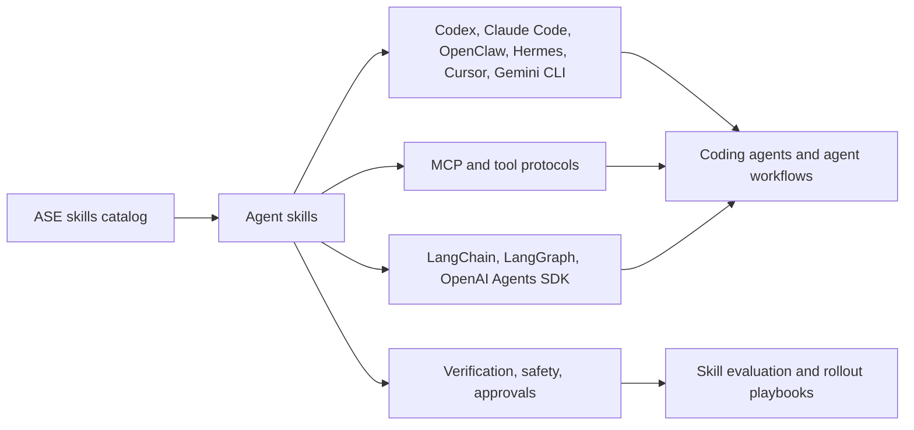
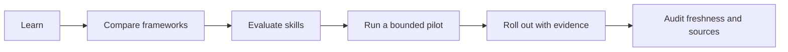

# Overview

This companion repo explains where agent skills fit in AI agent workflows and
how teams can move from learning to evaluation and rollout. The canonical skill
catalog remains [agentskillexchange/skills](https://github.com/agentskillexchange/skills).

## Ecosystem Map

## Adoption Flow

## Data Snapshot

| Metric | Count |
|---|---:|
| Source-backed resources | 38 |
| Official resources | 32 |
| Lab resources | 1 |
| Community resources | 2 |
| ASE resources | 3 |
| Representative mapped ASE skills | 43 |
| Playbooks | 6 |
| Templates | 8 |
| Generated indexes | 5 |

## Generated Indexes

- [Resource Index](generated/resource-index.md)
- [ASE Skill Mapping Index](generated/ase-skill-mapping-index.md)
- [Navigation Index](generated/nav-index.md)
- [Template Index](generated/template-index.md)
- [Repo Stats](generated/repo-stats.md)

## Use This Repo For

- Learning how agent skills relate to AI agents, coding agents, tools, MCP, and
  framework runtimes.
- Comparing Codex, Claude Code, OpenClaw, Hermes, Cursor, Gemini CLI,
  LangChain, LangGraph, and OpenAI Agents SDK resources.
- Evaluating skill quality, agent safety, verification evidence, and rollout
  readiness.
- Running small pilot workflows with playbooks and templates before production
  adoption.
