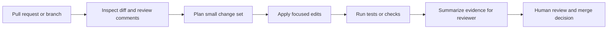

# Coding Agent PR Review Stack

## Who This Stack Is For

Engineering teams, staff engineers, and maintainers who want coding agents to
help review pull requests, respond to comments, and prepare evidence for human
review.

## Problem It Solves

PR work often mixes code review, requested changes, test evidence, and summary
writing. This stack turns that into a bounded loop: inspect, plan, edit, verify,
and hand back a reviewable result.

## Workflow

## Representative ASE Skills

- [`staff-engineer-mode`](https://agentskillexchange.com/skills/staff-engineer-mode/)
- [`address-github-pr-review-comments-from-the-current-branch-with-gh-address-comments`](https://agentskillexchange.com/skills/address-github-pr-review-comments-from-the-current-branch-with-gh-address-comments/)
- [`run-terminal-native-coding-agent-workflows-with-github-copilot-cli`](https://agentskillexchange.com/skills/run-terminal-native-coding-agent-workflows-with-github-copilot-cli/)
- [`sync-agent-rules-and-skill-files-across-coding-assistants-with-ai-rules-sync`](https://agentskillexchange.com/skills/sync-agent-rules-and-skill-files-across-coding-assistants-with-ai-rules-sync/)

## Framework And Resource Links

- [Codex](../frameworks/codex.md)
- [Claude Code](../frameworks/claude-code.md)
- [GitHub Copilot](../frameworks/github-copilot.md)
- [Cursor](../frameworks/cursor.md)
- [Coding Agent User Starter Kit](../starter-kits/coding-agent-user.md)

## Setup Prerequisites

- Repository checkout with a clean branch.
- Access to pull request comments or review notes.
- Test command, lint command, or other project-specific verification.
- Clear boundary for what the agent may change.

## Safe Pilot Plan

1. Use an archived PR or a low-risk internal branch.
2. Ask the agent to map each review comment to a proposed action.
3. Limit edits to one concern at a time.
4. Require test output or a clear reason why tests could not run.
5. Have a maintainer review the diff and summary.

## Verification Evidence To Collect

- Review comments addressed.
- Files changed.
- Test, lint, or typecheck output.
- Unresolved risks and skipped requests.
- Reviewer decision.

## Rollout Risks

- Broad refactors hiding inside review fixes.
- Test gaps masked by confident summaries.
- Agent edits outside the intended PR scope.
- Misreading reviewer intent.

## When Not To Use This Stack

- Production hotfixes without a human reviewer.
- Repositories without runnable verification.
- PRs that require product or legal judgment before code changes.

## Next Steps

Use the [skill evaluation worksheet](../templates/skill-evaluation-worksheet.md)
for the first run, then graduate to the
[Engineering Teams Playbook](../playbooks/engineering-teams.md).
