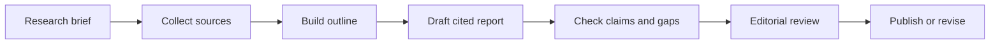

# Content Research Stack

## Who This Stack Is For

Research, content, documentation, and strategy teams that want agents to collect
sources, draft cited material, and keep unsupported claims visible.

## Problem It Solves

Research workflows can blur collection, synthesis, and writing. This stack keeps
source gathering, claim review, and editorial approval separate.

## Workflow

## Representative ASE Skills

- [`draft-cited-research-reports-with-storm`](https://agentskillexchange.com/skills/draft-cited-research-reports-with-storm/)
- [`run-autonomous-deep-research-workflows-with-gpt-researcher`](https://agentskillexchange.com/skills/run-autonomous-deep-research-workflows-with-gpt-researcher/)
- [`run-a-long-form-seo-blog-production-workflow-inside-claude-code-with-seo-machine`](https://agentskillexchange.com/skills/run-a-long-form-seo-blog-production-workflow-inside-claude-code-with-seo-machine/)
- [`build-versioned-technical-docs-sites-with-search-and-nav-using-material-for-mkdocs`](https://agentskillexchange.com/skills/build-versioned-technical-docs-sites-with-search-and-nav-using-material-for-mkdocs/)

## Framework And Resource Links

- [Content and Research Workflow](../workflows/content-and-research.md)
- [Content Research Teams Playbook](../playbooks/content-research-teams.md)
- [Quality Checklist](../examples/quality-checklist.md)

## Setup Prerequisites

- Research question and intended audience.
- Source rules: allowed domains, citation expectations, and excluded sources.
- Editorial owner.
- Claim review process.

## Safe Pilot Plan

1. Pick a public-source topic.
2. Require source collection before drafting.
3. Mark unsupported or weak claims.
4. Run editorial review before publication.
5. Record which sources were used and rejected.

## Verification Evidence To Collect

- Source list.
- Citation coverage for key claims.
- Unsupported claim notes.
- Editorial review comments.
- Final publish or reject decision.

## Rollout Risks

- Unsupported claims presented as facts.
- Over-optimized SEO language.
- Citation padding.
- Mixing community opinions with official documentation.

## When Not To Use This Stack

- Legal, medical, financial, or regulated claims without subject-matter review.
- Content requiring confidential sources.
- Topics where source quality cannot be evaluated.

## Next Steps

Use the [post-pilot review template](../templates/post-pilot-review.md) after
the first draft to decide whether this workflow saves time without lowering
source quality.
