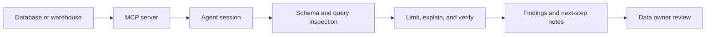

# MCP Database Inspection Stack

## Who This Stack Is For

Data engineers, platform teams, analytics engineers, and developers who want an
agent to inspect database context through MCP without granting broad write
access.

## Problem It Solves

Agents often need schema, sample rows, and query context. This stack keeps the
first workflow read-only, auditable, and narrow before any write or migration
work is considered.

## Workflow

## Representative ASE Skills

- [`postgresql-mcp-server`](https://agentskillexchange.com/skills/postgresql-mcp-server/)
- [`query-and-inspect-postgres-databases-through-mcp-with-pgedge-postgres-mcp`](https://agentskillexchange.com/skills/query-and-inspect-postgres-databases-through-mcp-with-pgedge-postgres-mcp/)
- [`translate-and-validate-sql-across-dialects-with-sqlglot`](https://agentskillexchange.com/skills/translate-and-validate-sql-across-dialects-with-sqlglot/)
- [`inspect-large-csv-files-interactively-before-cleanup-mapping-or-downstream-transforms-with-csvlens`](https://agentskillexchange.com/skills/inspect-large-csv-files-interactively-before-cleanup-mapping-or-downstream-transforms-with-csvlens/)

## Framework And Resource Links

- [MCP](../frameworks/mcp.md)
- [LangChain / LangGraph](../frameworks/langchain-langgraph.md)
- [MCP Tooling User Starter Kit](../starter-kits/mcp-tooling-user.md)
- [Data Teams Playbook](../playbooks/data-teams.md)

## Setup Prerequisites

- Read-only database credentials.
- MCP server reviewed and installed from a trusted source.
- Query limits and table allowlist.
- Logging for queries and agent outputs.

## Safe Pilot Plan

1. Start with a staging database or sample schema.
2. Allow only schema inspection and limited read queries.
3. Validate generated SQL before execution.
4. Compare a sample of results outside the agent.
5. Record permissions and query evidence.

## Verification Evidence To Collect

- MCP server configuration.
- Credential scope.
- Queries run and row limits.
- Query validation output.
- Data owner approval.

## Rollout Risks

- Overbroad credentials.
- Accidental production writes.
- Sensitive data exposed in logs.
- Agent-generated SQL that is syntactically valid but semantically wrong.

## When Not To Use This Stack

- Workflows requiring write access before a read-only pilot.
- Regulated data without an approved access and logging plan.
- Databases without an owner who can review the queries.

## Next Steps

Use the [risk review template](../templates/risk-review.md) before expanding
access beyond read-only inspection.
