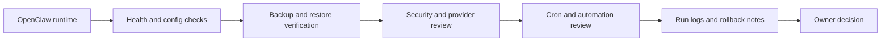

# Runtime Ops: OpenClaw Stack

## Who This Stack Is For

Agent runtime operators who use OpenClaw or similar systems for scheduled work,
provider routing, skills, tools, channels, and production-like automations.

## Problem It Solves

Runtime operations need repeatable health checks, backups, hardening, prompt
discipline, and rollback paths. This stack turns day-2 agent runtime management
into a reviewable operational loop.

## Workflow

## Representative ASE Skills

- [`run-day-2-openclaw-operations-with-production-runbooks-and-reusable-prompt-patterns-from-openclaw-runbook`](https://agentskillexchange.com/skills/run-day-2-openclaw-operations-with-production-runbooks-and-reusable-prompt-patterns-from-openclaw-runbook/)
- [`back-up-and-restore-an-openclaw-workspace-to-synology-nas-with-verification-and-rollback-safety-using-synology-backup`](https://agentskillexchange.com/skills/back-up-and-restore-an-openclaw-workspace-to-synology-nas-with-verification-and-rollback-safety-using-synology-backup/)
- [`deploy-an-agent-readable-openclaw-defense-matrix-and-hardening-audit-with-openclaw-security-practice-guide`](https://agentskillexchange.com/skills/deploy-an-agent-readable-openclaw-defense-matrix-and-hardening-audit-with-openclaw-security-practice-guide/)
- [`mirror-and-back-up-openclaw-workspaces-to-your-own-storage-with-openclaw-workspace-sync`](https://agentskillexchange.com/skills/mirror-and-back-up-openclaw-workspaces-to-your-own-storage-with-openclaw-workspace-sync/)

## Framework And Resource Links

- [OpenClaw](../frameworks/openclaw.md)
- [Runtime Ops: OpenClaw Case Study](../case-studies/runtime-ops-openclaw.md)
- [OpenClaw Docs](https://docs.openclaw.ai/)
- [Rollout Readiness Template](../templates/rollout-readiness.md)

## Setup Prerequisites

- Runtime owner and allowed maintenance window.
- Access to config, logs, backup target, and service manager.
- Known-good rollback path.
- Cron inventory and expected success criteria.

## Safe Pilot Plan

1. Run read-only health checks first.
2. Verify backup restore in a non-production target.
3. Review provider keys, owner allowlists, and cron prompts.
4. Change at most one bounded operational setting.
5. Capture before/after logs and rollback notes.

## Verification Evidence To Collect

- Health check output.
- Backup and restore evidence.
- Config diff.
- Cron run logs.
- Rollback command and owner approval.

## Rollout Risks

- Breaking scheduled production automations.
- Losing workspace state or credentials.
- Provider/model changes that affect cron behavior.
- Hidden dependency on a stale checkout or local-only config.

## When Not To Use This Stack

- Unowned runtime instances.
- Systems without backup or rollback.
- High-risk provider/key changes during active cron windows.

## Next Steps

Use the [rollout readiness template](../templates/rollout-readiness.md) before
making runtime changes that affect scheduled work.
