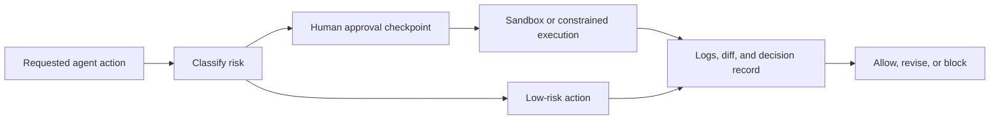

# Security Approval Stack

## Who This Stack Is For

Security teams, engineering managers, and platform owners who need human
approval and sandboxing around risky agent actions.

## Problem It Solves

Agent workflows can cross risk boundaries quickly: dependency changes, shell
commands, generated code, production access, or secret handling. This stack adds
approval checkpoints and execution isolation before high-risk actions.

## Workflow

## Representative ASE Skills

- [`route-risky-coding-agent-work-through-human-approval-checkpoints-with-humanlayer`](https://agentskillexchange.com/skills/route-risky-coding-agent-work-through-human-approval-checkpoints-with-humanlayer/)
- [`run-agent-generated-code-in-local-microvm-sandboxes-with-microsandbox`](https://agentskillexchange.com/skills/run-agent-generated-code-in-local-microvm-sandboxes-with-microsandbox/)
- [`scan-project-dependencies-for-supply-chain-vulnerabilities-with-murphysec`](https://agentskillexchange.com/skills/scan-project-dependencies-for-supply-chain-vulnerabilities-with-murphysec/)
- [`red-team-agent-workflows-for-jailbreaks-prompt-injection-and-policy-failures-with-deepteam`](https://agentskillexchange.com/skills/red-team-agent-workflows-for-jailbreaks-prompt-injection-and-policy-failures-with-deepteam/)
- [`apply-rule-based-guardrails-to-agent-traces-and-tool-flows-with-invariant`](https://agentskillexchange.com/skills/apply-rule-based-guardrails-to-agent-traces-and-tool-flows-with-invariant/)

## Framework And Resource Links

- [Security and Guardrails Workflow](../workflows/security-and-guardrails.md)
- [Security Teams Playbook](../playbooks/security-teams.md)
- [Security Review Template](../templates/security-review.md)
- [ASE Verification](https://github.com/agentskillexchange/skills/tree/main/verification)

## Setup Prerequisites

- Risk classes for commands, files, dependencies, credentials, and deployments.
- Approval owner and response channel.
- Sandbox or constrained runtime for generated code.
- Log storage for decisions and outputs.

## Safe Pilot Plan

1. Use fixture repos and intentionally risky test actions.
2. Confirm low-risk actions proceed and high-risk actions pause.
3. Record approval, denial, and timeout behavior.
4. Run generated code only in the sandbox.
5. Review evidence with security and engineering owners.

## Verification Evidence To Collect

- Approval request and response.
- Commands blocked or allowed.
- Sandbox logs.
- Dependency or security scan output.
- Final human decision.

## Rollout Risks

- Approval fatigue.
- Incomplete risk classification.
- Sandbox escape assumptions.
- Logs that expose secrets or sensitive code.

## When Not To Use This Stack

- Teams without a named approver.
- Workflows where the approval record cannot be stored.
- Production operations without rollback and monitoring.

## Next Steps

Start with the [security review template](../templates/security-review.md), then
move to the [rollout readiness template](../templates/rollout-readiness.md).
