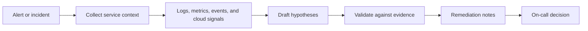

# SRE Incident Triage Stack

## Who This Stack Is For

SRE, platform, and on-call teams that want an agent to help collect incident
context, summarize signals, and draft next steps without taking production
action automatically.

## Problem It Solves

Incident response is often slowed by scattered logs, metrics, Kubernetes state,
and alert context. This stack narrows the first agent role to read-only triage
and evidence collection.

## Workflow

## Representative ASE Skills

- [`investigate-production-incidents-across-kubernetes-and-cloud-signals-with-holmesgpt`](https://agentskillexchange.com/skills/investigate-production-incidents-across-kubernetes-and-cloud-signals-with-holmesgpt/)
- [`investigate-production-incidents-across-observability-signals-and-draft-next-remediation-steps-with-opensre`](https://agentskillexchange.com/skills/investigate-production-incidents-across-observability-signals-and-draft-next-remediation-steps-with-opensre/)
- [`tail-multi-pod-kubernetes-logs-by-label-during-incidents-with-stern`](https://agentskillexchange.com/skills/tail-multi-pod-kubernetes-logs-by-label-during-incidents-with-stern/)
- [`lint-and-validate-prometheus-alerting-rules-before-noisy-or-broken-alerts-reach-production-with-pint`](https://agentskillexchange.com/skills/lint-and-validate-prometheus-alerting-rules-before-noisy-or-broken-alerts-reach-production-with-pint/)

## Framework And Resource Links

- [SRE and Incident Ops Workflow](../workflows/sre-incident-ops.md)
- [SRE and Platform Teams Playbook](../playbooks/sre-platform-teams.md)
- [Runtime Ops: OpenClaw Case Study](../case-studies/runtime-ops-openclaw.md)

## Setup Prerequisites

- Read-only observability and Kubernetes access for the pilot.
- Incident fixture or historical incident timeline.
- Clear rule: agent drafts, human decides.
- Escalation path for production remediation.

## Safe Pilot Plan

1. Replay a historical incident or staging alert.
2. Limit the agent to read-only commands.
3. Ask for evidence-linked hypotheses, not automatic fixes.
4. Compare draft findings to the actual incident review.
5. Capture gaps and false positives.

## Verification Evidence To Collect

- Alert ID and service context.
- Commands and queries run.
- Logs or metrics referenced.
- Hypotheses accepted or rejected.
- Human-approved next steps.

## Rollout Risks

- Acting on correlation instead of causation.
- Production commands hidden inside triage.
- Sensitive logs copied into unsafe places.
- Overconfidence during high-pressure incidents.

## When Not To Use This Stack

- Incidents requiring immediate manual failover.
- Environments without read-only access boundaries.
- Teams without runbooks or escalation ownership.

## Next Steps

Use the [pilot plan template](../templates/pilot-plan.md) on a historical
incident before moving to live read-only triage.
