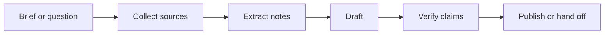

# Content And Research

## Who This Is For

Researchers, technical writers, content teams, documentation owners, and teams
that need agents to produce source-backed written work.

## Where Skills Fit

Skills keep research and content workflows grounded: they specify source
collection, citation checks, editorial constraints, and publish handoff steps.

## Representative ASE Skills

| Skill | Role |
|---|---|
| `draft-cited-research-reports-with-storm` | Cited research report drafting. |
| `run-autonomous-deep-research-workflows-with-gpt-researcher` | Autonomous research with source collection. |
| `run-a-long-form-seo-blog-production-workflow-inside-claude-code-with-seo-machine` | Long-form SEO content production. |
| `build-versioned-technical-docs-sites-with-search-and-nav-using-material-for-mkdocs` | Technical docs publishing. |
| `export-obsidian-vaults-into-clean-markdown-trees-for-publishing-or-downstream-processing` | Knowledge-base export for publishing. |
| `search-and-analyze-arxiv-papers-through-mcp-workflows` | Academic paper search through MCP workflows. |

## Best-Practice Notes

- Separate source collection from drafting.
- Keep citations close to claims.
- Avoid invented titles, statistics, or authority claims.
- Use editorial constraints before generation, not after.
- Verify links and named entities before publishing.

Related: [Claude Code](../frameworks/claude-code.md),
[LangChain and LangGraph](../frameworks/langchain-langgraph.md),
[Best Practices](../best-practices.md).

