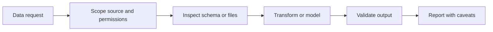

# Data Platform

## Who This Is For

Data engineers, analytics engineers, database operators, and platform teams who
want agents to inspect data systems without turning every query into a risky
write operation.

## Where Skills Fit

Skills make data-agent work safer by naming read/write boundaries, schemas,
lineage checks, and validation steps.

## Representative ASE Skills

| Skill | Role |
|---|---|
| `query-and-inspect-postgres-databases-through-mcp-with-pgedge-postgres-mcp` | Read-oriented Postgres inspection through MCP. |
| `run-deterministic-sql-and-dbt-analysis-under-coding-agents-with-altimate-code` | Deterministic SQL and dbt analysis. |
| `compare-dbt-models-and-warehouse-relations-before-trusting-migration-parity-with-dbt-audit-helper` | Migration parity checks. |
| `translate-and-validate-sql-across-dialects-with-sqlglot` | SQL dialect translation and validation. |
| `inspect-large-csv-files-interactively-before-cleanup-mapping-or-downstream-transforms-with-csvlens` | CSV inspection before transformation. |
| `operate-airflow-and-warehouse-workflows-through-agent-safe-data-engineering-skills-with-astronomer-agents` | Airflow and warehouse workflow operations. |

## Best-Practice Notes

- Start read-only.
- State table, database, or warehouse scope.
- Include row limits for exploration.
- Validate generated SQL before execution.
- Report assumptions, missing data, and caveats.

Related: [LangChain and LangGraph](../frameworks/langchain-langgraph.md),
[MCP](../frameworks/mcp.md), [Best Practices](../best-practices.md).

