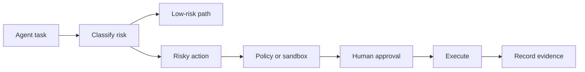

# Security And Guardrails

## Who This Is For

Security engineers, AI governance leads, platform owners, and teams allowing
agents to run tools, write code, or touch production-adjacent systems.

## Where Skills Fit

Skills encode approval rules, sandbox boundaries, verification checks, and audit
evidence so agents do not treat every task as equally safe.

## Representative ASE Skills

| Skill | Role |
|---|---|
| `scan-project-dependencies-for-supply-chain-vulnerabilities-with-murphysec` | Dependency and supply-chain scanning. |
| `route-risky-coding-agent-work-through-human-approval-checkpoints-with-humanlayer` | Human approval checkpoints. |
| `red-team-agent-workflows-for-jailbreaks-prompt-injection-and-policy-failures-with-deepteam` | Agent red-team testing. |
| `apply-rule-based-guardrails-to-agent-traces-and-tool-flows-with-invariant` | Trace and tool-flow policy checks. |
| `run-agent-generated-code-in-local-microvm-sandboxes-with-microsandbox` | Isolated execution for generated code. |
| `govern-agent-skills-mcp-servers-prompts-and-tool-calls-with-defenseclaw` | Governance over skills, prompts, tools, and MCP servers. |

## Best-Practice Notes

- State what the agent may not do.
- Treat secrets, production writes, and shell access as explicit risk points.
- Log approvals and denied actions.
- Separate scanning from remediation.
- Keep policy text short enough for agents to actually follow.

Related: [Best Practices](../best-practices.md), [MCP](../frameworks/mcp.md),
[OpenAI Agents](../labs/openai.md).

