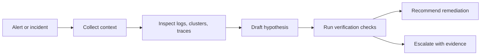

# SRE And Incident Ops

## Who This Is For

SREs, platform engineers, DevOps teams, and incident commanders who need agents
to inspect signals, run bounded commands, and produce evidence-backed next
steps.

## Where Skills Fit

Skills help agents avoid guessing. They define the commands to run, the signals
to inspect, and the evidence needed before remediation.

## Representative ASE Skills

| Skill | Role |
|---|---|
| `deploy-kubernetes-native-agents-with-kagent` | Kubernetes-native agent operations. |
| `investigate-production-incidents-across-kubernetes-and-cloud-signals-with-holmesgpt` | Incident investigation across Kubernetes and cloud data. |
| `investigate-production-incidents-across-observability-signals-and-draft-next-remediation-steps-with-opensre` | Observability-to-remediation workflow. |
| `tail-multi-pod-kubernetes-logs-by-label-during-incidents-with-stern` | Focused log collection during incidents. |
| `lint-and-validate-prometheus-alerting-rules-before-noisy-or-broken-alerts-reach-production-with-pint` | Alert quality verification. |
| `analyze-kubernetes-cluster-issues-through-mcp-with-k8sgpt` | MCP-assisted Kubernetes issue analysis. |

## Best-Practice Notes

- Prefer read-only inspection before mutation.
- Include exact namespaces, clusters, or environments.
- Require evidence before remediation.
- Preserve logs and command output in the incident record.
- Add approval checkpoints before destructive changes.

Related: [OpenClaw](../frameworks/openclaw.md), [MCP](../frameworks/mcp.md),
[Security and Guardrails](security-and-guardrails.md).

